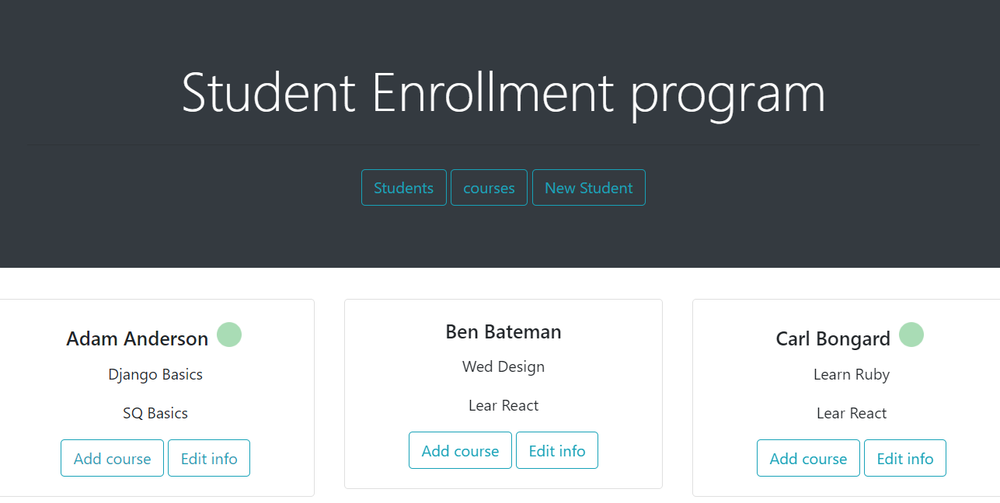
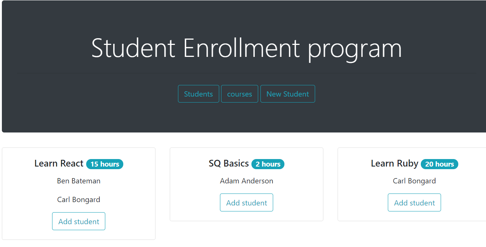

# Front End 1 Week 6 Assignment Directions

Now you know how to create webpages using HTML, CSS and JavaScript. You also know how to use links between pages, Bootstrap and fetching data.

In this Assignment we are going to create a **Student Enrollment program**,
The program allows the new and currents students enroll in different courses but **no more than 4 courses per student and no more than 3 students per course** also the student's status must be active to enroll in a new course.

Yes as you read before NEW AND CURRENT students which means the program also allows the user to register a new student in the  (if the student is not registered)in order to enroll them in a course. You will get current students data fetching the link below.

All right ... so the question is will the program work?
The index.html file has 3 buttons: Students, Courses and New_Estudent

**If the user clicks "Students":** the program display the list of all students with their information
* name
* last last
* green circle if the student's status is active. Nothing if is not active
* enrolled curses
* 'edit' button (allow to change student information)
* 'add course' button (add another curse)

This is an Example

**If the user clicks "Courses":** the program display the list of courses with their information
* name
* duration
* students (the students enrolled in that course)
* 'add student' button (enroll a current student to that course)

This is an Example

**If the user clicks "New Student":** the program allows the user to register a new student by posting an object to the following POST endpoint - https://student-challenge-api.herokuapp.com/students that contains a "name" and a "last_name" attribute. If it is successful you will receive back a success messaage and the new student in the response along with their id. 
note: it will not show up in the array of students when you do a GET request (it is not hooked up to a database) this is just to simulate posting data to a database but you should add this student to your local students array. 

GET endpoints

Students data link:
https://code-the-dream-school.github.io/JSONStudentsApp.github.io/Students.json
The response is a json Array of students objects with the following properties: name, last_name, status and id. The status property means if the student is active or not to take courses.

Courses data link:
https://code-the-dream-school.github.io/JSONStudentsApp.github.io/Courses.json
The response is a json Array of courses objects with the following properties: name, duration, and id.
